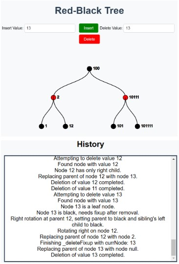

## DSA Eksamensprojekt Red-Black Tree

Som en del af vores eksamensprojekt har vi implementeret en Red-Black Tree, som er et selvbalancerende binært søgetræ-algoritme. I vores repræsentation af algoritmen kan man tilføje og slette tal, for at se hvordan algoritmen balancerer det her binary search tree. Hver gang man tilføjer eller sletter et tal, viser modellen hvordan den rykker rundt og balanceres. Man kan også følge med i historikken og se præcis hvordan algoritmen tænker og dens processer i at den rykker rundt på noderne.

## Links til projekt:

Deploy: https://tora0001.github.io/DSA-reeksamen/

Repo: https://github.com/tora0001/DSA-reeksamen
